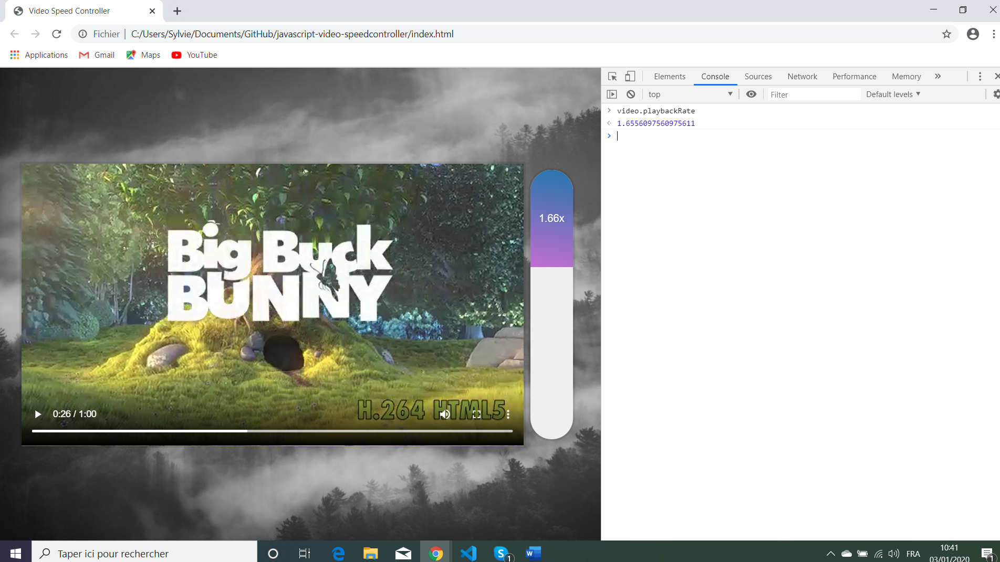

# Javascript Video Speed Controller

Wes Bos Youtube Tutorial: [Build a Experimental Video Speed Controller UI - #JavaScript30 28/30](https://www.youtube.com/watch?v=8gYN_EDMg_M&index=28&list=PLu8EoSxDXHP6CGK4YVJhL_VWetA865GOH).


*** Note: to open web links in a new window use: _ctrl+click on link_**

## Table of contents

* [General info](#general-info)
* [Screenshots](#screenshots)
* [Technologies](#technologies)
* [Setup](#setup)
* [Features](#features)
* [Status](#status)
* [Inspiration](#inspiration)
* [Contact](#contact)

## General info

* Tutorial Code using javascript to adjust the speed of a video via rhs bar vertical position on scale.

## Screenshots

.

## Technologies

* Ran in Google Chrome browser with: [Javascript engine V8 7.9.317.32 for Windows (x64)](https://v8.dev/).

## Setup

* Open index.html in browser. If any code is changed the browser needs to be refreshed.

## Code Examples

* Function to convert mouse pos in speed bar to video playback speed and bar video speed display.

```javascript
// measure mouse vertical position, convert to % betwen 0.4 and 4 playback speeds. 
// speed bar height & video playbackrate depend on this value, display a speed to 2dp.
function handleMove(e) {
  const y = e.pageY - this.offsetTop;
  const percent = y / this.offsetHeight;
  const min = 0.4;
  const max = 4;
  const height = Math.round(percent * 100) + '%';
  const playbackRate = percent * (max - min) + min;
  bar.style.height = height;
  bar.textContent = playbackRate.toFixed(2) + 'x';
  video.playbackRate = playbackRate;
};
```

## Features

*  Unsplash background changes daily. Displays video playback to 2 dp.

## Status & To-Do List

* Status: Working.

* To-Do: Nothing.

## Inspiration

* Wes Bos Youtube Tutorial: [Build a Experimental Video Speed Controller UI - #JavaScript30 28/30](https://www.youtube.com/watch?v=8gYN_EDMg_M&index=28&list=PLu8EoSxDXHP6CGK4YVJhL_VWetA865GOH).

## Contact

Repo created by [ABateman](https://www.andrewbateman.org) - feel free to contact me!
